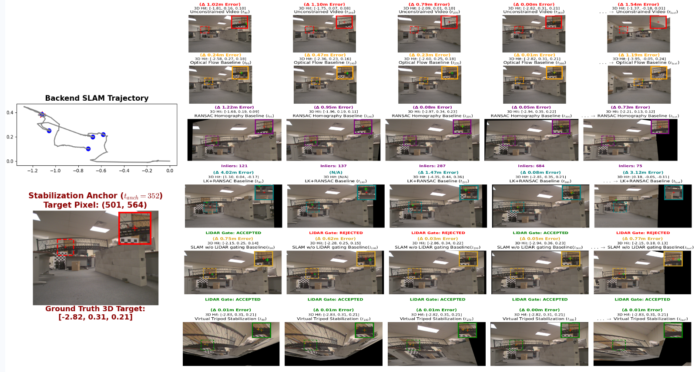
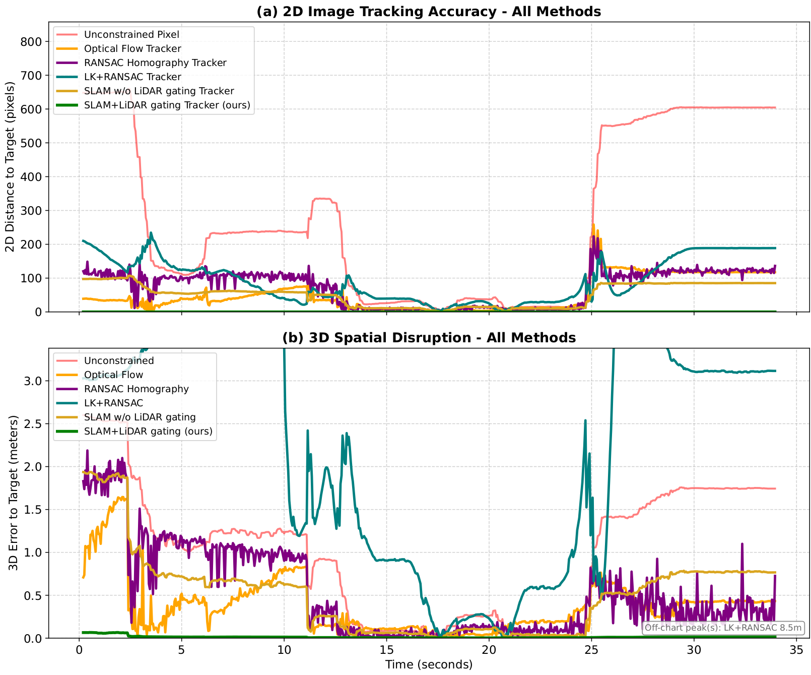
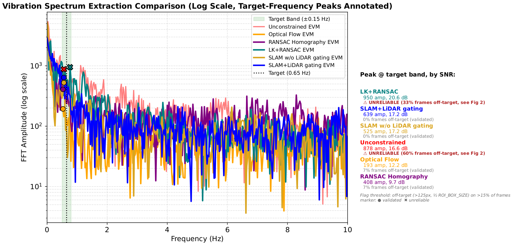

# GLEAM: Automated Structural Health Monitoring from Mobile Platforms via LiDAR-Gated Deep Motion Magnification

Traditional Eulerian Video Magnification (EVM) is strictly limited to static cameras; even microscopic camera ego-motion generates massive parallax artifacts that engulf the target signal. GLEAM bridges this gap, enabling high-fidelity, sub-pixel motion magnification directly from moving platforms (UGVs/UAVs) in unconstrained 3D environments. 

By coupling 6-DoF SLAM stabilization (the "Virtual Tripod") with a deterministic 3D LiDAR volumetric gate, GLEAM actively neutralizes camera kinematics and completely excises off-plane background clutter. This pipeline isolates the true structural manifold, allowing the Swin Transformer-based magnifier (STB-VMM) to extract actionable, high-SNR micro-vibrations for automated Structural Health Monitoring (SHM)—entirely eliminating the need for static scaffolding or fixed camera setups.

# Dependencies
The framwork has been tested with ROS-Humble with Ubuntu 22.04. The following configuration, along with the required dependencies, has been verified for compatibility:

- [PCL >= 1.8](https://pointclouds.org/downloads/)
- [Eigen >= 3.3.4](http://eigen.tuxfamily.org/index.php?title=Main_Page)
- [CUDA toolkit >= 11](https://developer.nvidia.com/cuda-downloads)
- Numpy >= 1.26
- Matplotlib 3.7.2
- Opend3d
- Pandas >= 2.3

# System workflow
The GLEAM framework processes unconstrained, multi-modal sensor data from a moving UGV to extract isolated structural micro-vibrations. The pipeline operates in five primary stages:

**1. Multi-Modal Data Acquisition**
* **Inputs:** Synchronized RGB video, 3D LiDAR point clouds, and IMU telemetry captured from an actively moving robotic platform.

```
    mkdir ros2_ws
    cd ~/ros2_ws/src  // Copy the robus_lidar_inertial there and make sure ROS2 is installed
    colcon build
    ros2 launch robust_lidar_inertial  run_culvertron.launch.py 

    // Open another terminal to run dataset
    ros2 play dataset.db
```
* **Outputs:** global_map.pcd (The actual 3D map of the physical scense built from LiDAR), transforms.json (transformation including Rotation matrix and Translation from the orignal starting point to others correposnding with N camera frames), splat_data (the folder of full camera frame "images/frame_N.jpg").

  
**2. Kinematic Neutralization (The "Virtual Tripod")**
* **Process:** Leverages 6-DoF SLAM (Simultaneous Localization and Mapping) to track the camera's global trajectory.  Bypasses computationally heavy 2D segmentation by executing a deterministic raycast into the aligned LiDAR point cloud to extract the target's true depth ($Z_{ref}$). A strict volumetric acceptance gate ($Z_{ref} \pm 0.04$m) is applied ($z_{ref} is selected based on experiments$).
* **Output:** The framework inverts the robotic ego-motion, locking onto a user-defined Region of Interest ($\mathcal{B}_{ROI}$) and stabilizing the visual target into a rigid Eulerian domain. All off-plane geometry (overlapping foreground clutter and background parallax) is rejected, resulting in a spatially pruned tensor with high geometric purity and a significantly reduced memory footprint.
```
  python3 Neutralization_and_Pruning.py
```
<p align='center'>
    
    
    
</p>

# Debug
```
  python3 clean_json.py   // If the json file having issue.
  python3 pick_pixel.py   // Find exact pixel corresponding with target.
```
